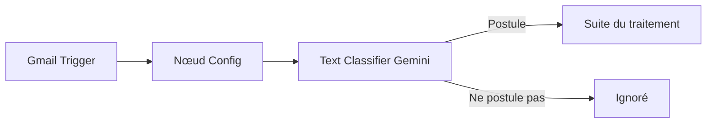
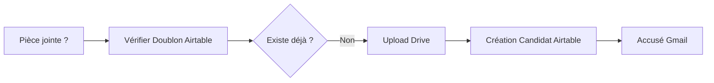
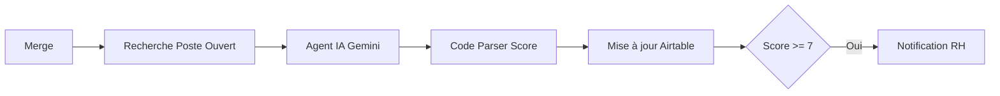

# Architecture Technique

Le workflow est divisé en trois grands flux.

## Flux 1 : Ingestion & Tri

```mermaid
graph LR
  A[Gmail Trigger] --> B[Nœud Config]
  B --> C[Text Classifier Gemini]
  C -- Postule --> D[Suite du traitement]
  C -- Ne postule pas --> E[Ignoré]
```

## Flux 2 : Gestion des fichiers et Doublons

```mermaid
graph LR
  A[Pièce jointe ?] --> B[Vérifier Doublon Airtable]
  B --> C{Existe déjà ?}
  C -- Non --> D[Upload Drive]
  D --> E[Création Candidat Airtable]
  E --> F[Accusé Gmail]
```

## Flux 3 : Évaluation IA

```mermaid
graph LR
  A[Merge] --> B[Recherche Poste Ouvert]
  B --> C[Agent IA Gemini]
  C --> D[Code Parser Score]
  D --> E[Mise à jour Airtable]
  E --> F{Score >= 7}
  F -- Oui --> G[Notification RH]
```
